 
# "Hemat Internet dengan Konfigurasi Apt-Get di Ubuntu" 

## Hal-hal yang perlu di siapkan :
    - Laptop yang sudah Terinstal Ubuntu Dekstop

## Apa targetnya?

#### Targetnya yang utama ada 2:

1) mematikan sistem upgrade otomatis pada Ubuntu

2) mengecilkan sekecil mungkin unduhan apt-get update

Harus Anda ketahui, Ubuntu Official Family semuanya telah dipasangi automatic upgrade.
Artinya, setiap Anda jalankan (termasuk livecd, termasuk permanent) dia bisa mengunduh data segede 200MB dalam waktu kurang dari 1 jam.

Kalau Anda livecd, dan biasanya itu adalah seorang penulis, maka Anda akan sering kehabisan kuota beratus MB gara-gara fitur automatic upgrade ini.

Dan!

Harus juga Anda ketahui, satu kali sudo apt-get update, Anda mengunduh data segede 50MB-an.
Kalau Anda sehari 2 kali lakukan, berarti sehari habis 100MB hanya untuk apt-get update. Berarti ini sangat `BOROS`

Dan di sini saya akan membagikan cara untuk menyembuhkannya.

Materi ini berlaku untuk:

1) Ubuntu dan 10 saudara kembarnya

2) Debian

3) Linux Mint

4) elementary OS

5) deepin

6) neon

7) distro apa saja yang punya hubungan dengan packagekit dan snapd

`Pasti ada yang merasa internetnya lambat di Ubuntu. Kenapa ? Atau merasa "kok, kuota saya cepat habis" di Ubuntu.
`
> Itu terjadi karena di balik layar ada sistem yang makan internet Anda tanpa izin Anda.

Di luar negeri, seperti Amerika Serikat, mungkin hal ini tak mengapa. Namun di Indonesia, ini akan jadi masalah besar.
Sebab internet di sini sangat mahal.

Baik, kita masuk ke materi.

Ringkasan:
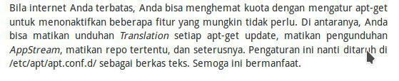

Ini rangkuman apa-apa saja yang Anda bisa lakukan.

Saya percaya, anda merasa  istilah-istilah di situ asing buat Anda. Justru karena asing itu Anda harus tahu, biar kuota Anda tidak habis.

Yak, kabar buruknya : 
- Ubuntu tidak hanya memiliki automatic upgrade.

- Ubuntu juga punya fasilitas snappy (snapd).

`Dia aktif di balik layar kemudian akan mengunduh file besar dari internet.Jadi kuota Anda akan diserap luar biasa tidak cuma oleh automatic upgrade, tetapi juga oleh snapd.
Dan lebih sedih lagi, tidak berhenti di situ, Ubuntu punya fasilitas AppStream yang juga mengunduh data-data dari internet banyak sekali tanpa izin Anda.`

#### Apa itu AppStream ?

> AppStream adalah teknologi yang dipakai oleh "Ubuntu Software Center".

Walau Anda tidak menjalankannya,si AppStream-nya jalan di balik layar, dan dia ngunduh data gede banget.

Nah, Kesimpulan dari semua masalah yang terjadi yaitu : 

1) automatic upgrade

2) snapd

3) AppStream

Semuanya memakan/menggunakan `INTERNET`.

## Bagaimana cara melihat servis-servis yang aktif ?

Disini saya akan mengajarkan bagaimana melihat servis-servis yang aktif (ya, "melihat" dulu),kemudian memperkecil jumlah unduhan apt-get update.

Pertama, 

coba jalankan `sudo apt-get update` 

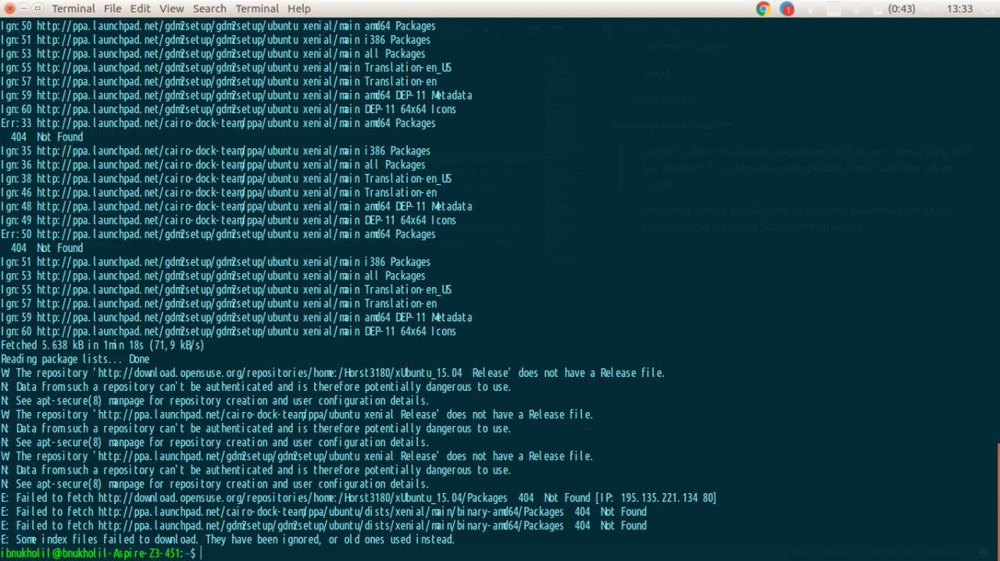 

screeshoot di atas tidak bersih sebab sudah pernah apt-get update sebelumnya.

### bagaimana cara menentuin dia bersih atau tidak ?

Kalau dia tidak bersih, maka Anda tidak akan tahu, besarnya angka unduhan yang Anda habiskan dan jika dia bersih maka akan kelihatan total unduhan anda berapa banyaknya

> Jika Anda mau bersih, hapus semua file di dalam `/var/lib/apt/lists/`, lalu lakukan apt-get update satu kali lagi.

## `Namun itu akan  memakan ~50MB data.`

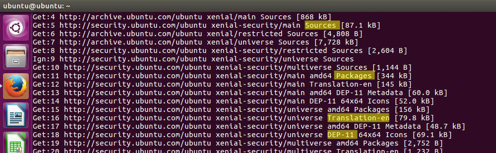

perhatikan gambar di atas 

> Ada Sources, Packages, Translation, dan DEP-11.

4 itu masing-masing mewakili 
- repositori source code, 
- repositori binary code, 
- repositori bahasa, dan 
- repositori AppStream.

Jika Ubuntu Anda itu masih murni (tidak pernah Anda ubah), maka pasti keempat-empatnya aktif `(boros).`

Jika 4 itu aktif, maka sekali apt-get update, Anda habis sekitar `50MB` . Padahal mestinya cukup `8-9MB saja.`

Nah, disini saya akan membagi ilmu sedikit tentang `bagaimana mengurangi unduhan yang 50MB (boros) itu jadi 9MB (hemat).`

Nantinya, setiap Anda apt-get update, Anda gak ngunduh 50MB lagi. Tapi cuma 9MB atau kurang.


Sekrang, 

yang manakah yang anda butuhkan, dan mana yang tidak di butuhkan dari 4 repo di atas ?  
- Sources    
- Packages
- Translation
- DEP-11

> Yang dibutuhkan end-user secara praktiknya cuma repo Packages.

> Artinya repo Sources, Translation, dan DEP-11 aman jika Anda matikan.

Perhatikan:

3 jenis repo aktif
- Packages 
- Translation
- DEP-11

Di sini and bisa menghemat kuota dengan mematikan jenis repo Translation dan DEP11.

Sehingga `apt-get update` Anda tidak boros, tidak kebanyakan download, dan tidak panjang seperti gambar di atas.

perhatikan gambar di bawah ini :
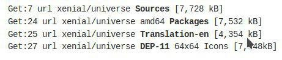
> yap, benar sekali ini adalah gambar apt-get update yang di lakukan ke 4 repo tersebur, kenapa dengan gamabr tersebut ?

    jawabannya satu kata: BOROS!

Perhatikan angka barisnya: 7 sampai 24. Berarti ada 24 baris.
Setiap barisnya 7MB (lihat di atas), kalau ada 24 baris, berarti apt-get update itu BOROS! jadi, kita akan perkecil dengan konfigurasi apt-get.

### Untuk mengecilkan unduhan apt-get update, kita bisa lakukan 3 hal: 

1) matikan unduhan Translation

2) matikan unduhan Sources

3) matikan unduhan DEP-11

## "Bagaimana Caranya ?" 

### 1. Matikan Unduhan Translation 
    
pada Konfigurasi bawaan, apt-get update selalu mengunduh indeks Translation" yang besar ukurannya tetapi seringnya tidak di butuhkan pengguna. 

Bagaimana cara menonaktifkannya ?
- masuk kedalam file `00aptitude` yang berda di `/etc/apt/apt.conf.d/00aptitude`.
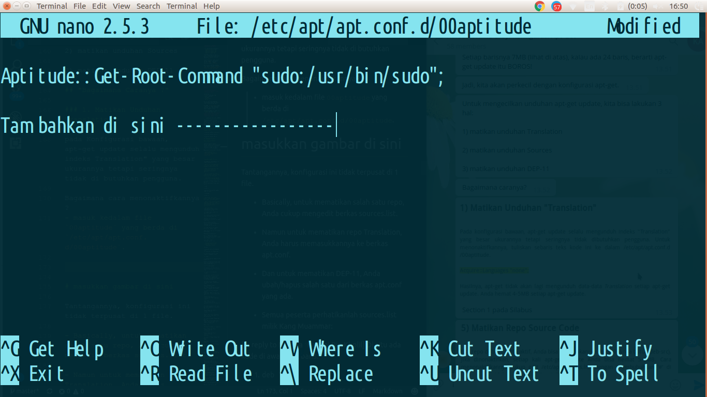

- lalu ketikan di baris barunya 
`Acquire::Languages"none";`
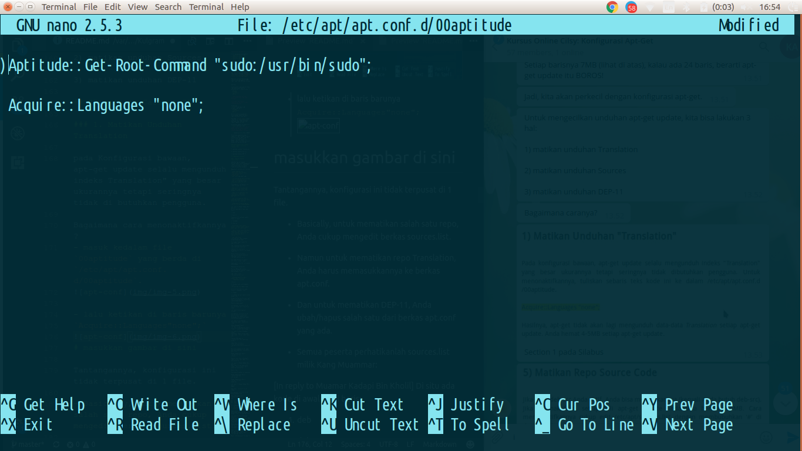

### 2. Matikan Repo Source Code
Jika Repo deb-src Anda aktif, anda bisa menonaktifkan apabila anda tidak membutuhkannya. jika anda menonaktifkannya anda akan menghemat kuota 5-6mb.

caranya :
- memberi tanda pagar (`#`) setiap yang berada di depan kata deb-src.
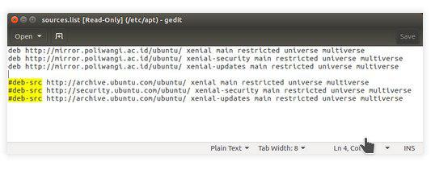

### 3. Matikan unduhan DEP-11

`DEP-11` (atau, `AppStream`) adalah Indeks spesial untuk program semisal `GNOME Software` (sebangsa Ubuntu Software & Muon Discover) yang memuat Informasi Gambar + detail aplikasi. Jika Anda tidak pernah memakai `GNOME Software`, Misalnya Anda Menggunakan Synaptic, maka Anda tidak butuh DEP-11. Nonaktifkan dengan salah satu cara berikut:

#### Cara Simpel ( Cepat ) :
   - Hapus berkas 50appstream di direktori `/etc/apt/apt.conf.d/` 
#### Cara Manual ( Teliti ):
  - Letakkan baris `DefaultEnabled "false";` di berkas 50appstream di bawah baris-baris `KeepCompressedAs`.

    Anda akan menghemat Kuota Sekitar 10-15mb setiap `apt-get update` jika mematikan Settingan Unduhan DEP-11.

Tantangannya, konfigurasi ini tidak terpusat di 1 file.

> - Basically, untuk mematikan salah satu repo, Anda cukup mengedit berkas sources.list.

> - Namun untuk mematikan repo Translation, Anda harus memasukkannya ke berkas apt.conf.
> - Dan untuk mematikan DEP-11, Anda ubah/hapus salah satu dari berkas apt.conf yang ada.

 Gambar 1.1

Gambar 1.2

>Di situ ada kode di awal-awal baris:
    >1) deb
    > 2) deb-src 

Yang muncul di apt-get update Anda itu ialah: 
1) Packages
2) Sources

Perhatikan, baris yang diawali tanda # (pagar) adalah baris mati. artinya nonaktif. Jadi artinya, kalau Anda mau mematikan repositori, Anda cukup Letakkan tanda # di awal baris yang Anda mau di sources.list. Dan sebaliknya! Jika ada baris mati, gimana menghidupkannya lagi?

- sekarang baris-baris mana saja yang aman dimatikan?

#### Sebelum itu, 

kita harus merapikan isi sources.list yang ruwet itu.

`Untuk Linux Mint, sources.list dia beradanya di beberapa file di /etc/apt/sources.list.d/
`
Bagaimana merapikannya?

lakukan perintah ini di Terminal (tidak akan mengedit file):
```
sed '/#/d; /^$/d' /etc/apt/sources.list
```

#### Sekarang masuk ke nomor 1: nonaktifkan Translation.
 Bagaimana caranya?

#### Caranya:

1) Gunakan sudo untuk membuka file /etc/apt/apt.conf/00aptitude

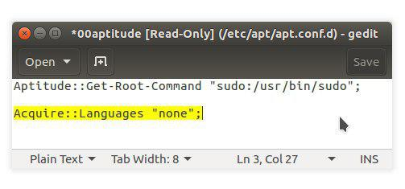Gambar 1.3


2) Tulis baris baru di sana: Acquire::Languages "none;"

3) Simpan

4) Lakukan apt-get update untuk mengujinya


# STOP DOLO !!!!


Dengan konfigurasi di atas, apt akan stop mengunduh Translation yang bermega-mega itu.


`Ketika Acquire Translation diset ke none, apakah akan berpengaruh ke deskripsi paket ketika buka Synaptic?`
> Pertanyaan bagus. Jawabannya tidak.

Tahukah Anda apa itu "Translation"? Dari mana dia diambil?

Coba lihat link ini http://archive.ubuntu.com/ubuntu/dists/artful/main/i18n/.

Bila Anda memakai 17.10, maka apt akan mengunduh Translation dari situ.

    untuk Ubuntu versi lain cukup ganti nama "artful" jadi nama rilis masing-masing.


## Silakan coba apt-get update maka pasti tidak akan ada lagi Translation diunduh.

- Di Linux Mint kok tidak ada Translation ya Kang??

- Dahulu kala, Ubuntu itu meletakkan semua konfigurasi dalam 1 file: /etc/apt/apt.conf.

- Di apt-get update-nya tidak ada? Kalau seperti itu, berarti Mint telah di-prakonfigurasi supaya mati Translation-nya.

- Saat ini, Ubuntu meletakkan konfigurasinya dalam file-file bernomor, di dalam folder /etc/apt/apt.conf.d/.


## Matikan repo source code.

Bagaimana cara menonaktifkan repo Sources?
 > Caranya:

1) Gunakan sudo untuk membuka /etc/apt/sources.list

2) Bubuhkan # di depan baris-baris deb-src

3) Simpan

4) Lakukan sudo apt-get update untuk mengujinya

## Kita lanjut ke nomor 3.

### Bagaimana mematikan repo DEP-11?

Alias, bagaimana mematikan repo AppStream?

Sebelum lanjut, saya peringatkan 2 hal:

1) DEP-11 makan data sangat banyak

2) Jika DEP-11 dimatikan, maka Ubuntu Software Center tidak berfungsi

- Semua peserta paham peringatan saya?

- Apa dengan meng-uninstall Software Center juga salah satu cara mematikan DEP-11 kang?

- Saya tidak pernah melakukannya jadi tidak tahu. Namun secara teori tidak berguna, sebab, apt akan tetap mengunduh DEP-11 selama DEP-11 tidak dimatikan manual.

- Kalau si USC dihapus, tapi appstreamcli masih ada di sistem Anda, dia tetap saja akan mengunduh diam-diam.

- USC itu bisa menayangkan info aplikasi + gambar-gambarnya, + bisa unduh aplikasi dari internet, itu bukan ngikut database-nya apt.

- USC itu punya database sendiri. Namanya DEP-11, alias AppStream.

Makanya Ubuntu sekarang boros.

Gimana mematikan repo DEP-11?

- Cara cepatnya kalau Anda pengen permanen mematikan DEP-11, cukup hapus file /etc/apt/apt.conf.d/50appstream.

- Ya saya sendiri. Saya sangat sering livecd Ubuntu, jadi supaya kuota saya gak kemakan DEP-11, selalu ketika setelah login saya hapus 50appstream ini.
- Setiap livecd saya selalu melakukan itu. Selalu.

- Adapun cara tidak cepat, cara teliti, yaitu edit isinya 50appstream.

- Isinya: bubuhkan baris DefaultEnabled "false"; dalam berkas 50appstream tadi di posisi di bawah baris KeepCompressedAs.

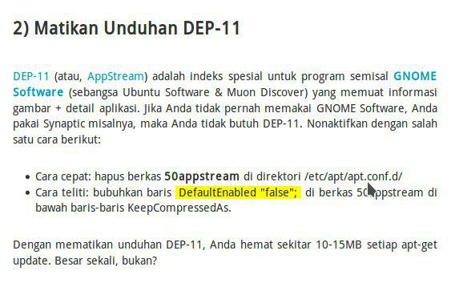Gambar 1.2


sebelumnya saya sudah jelaskan 3 penonaktifan.

Sekarang saya jelaskan caranya melihat servis/proses yang sedang aktif.

Jadi teknik ini penting agar Anda tahu siapa-siapa yang sedang makan internet Anda.

Ada 4 tersangka: apt, packagekit, snapd, dan unattended-upgrade.

Maka ada 4 macam perintah:

```bash 
- ps aux | grep -i apt

- ps aux | grep -i packagekit

- ps aux | grep -i snapd

- ps aux | grep -i unattended
```

example :
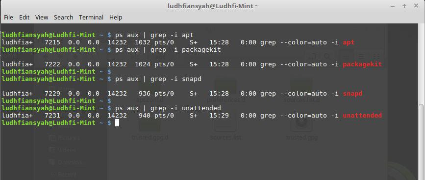Gambar 1.2

- Yap, sekarang Anda sudah tahu 4 perintah untuk memeriksa 4 "tersangka" pemakan bandwidth sistem Ubuntu.

- Yang paling penting Anda tahu bahwa keempat "tersangka" ini aktifnya secara random.

- Dia bisa aktif kapan saja, dan yang pasti itu ketika pertama kali selesai Ubuntu diinstal, atau ketika login livecd.

teks mana yang menunjukkan tidak aktif Kang??

Bagaimana tandanya dia aktif?

Contoh: lihat gambar saya:
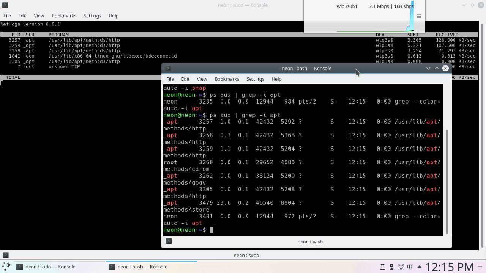Gambar 1.2

- Di atas itu, tampak ps aux berhasil menangkan "pelaku" yang aktif yaitu apt.

- Perhatikan ada 7 buah apt yang aktif!

- Dan perhatikan di jendela belakang, di NetHogs, itu 3 apt yang sedang makan bandwidth.

- Perhatikan indikator kecepatan internet di ujung atas-kanan.


Caranya, lihat kembali gambar Kang Dheny:

- Di sana tidak ada process apt sama sekali. Yang ada cuma grep -i apt yang Anda jalankan.

- Itu berarti si apt tidak aktif.

> saya tidak menjalankan apt, terus kok bisa apt bisa jalan sendiri?

> `Jawabannya adalah karena packagekitd.`

- Jadi packagekit aktif duluan, lalu dia memanggil sekian banyak program apt untuk mengunduh banyak files.

Maka dari itu, Anda harus dibekali 4 perintah:
```bash
ps aux | grep -i apt

ps aux | grep -i packagekit

ps aux | grep -i snapd

ps aux | grep -i unattended
```

Dan tahu dari mana adanya packagekitd?

Lihat gambar ini :
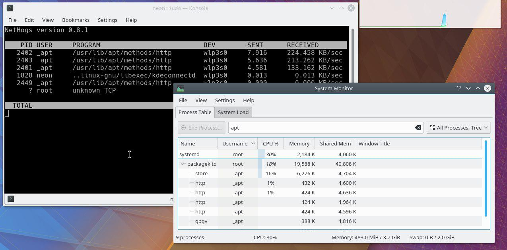Gambar 1.2

Itu packagekitd yang menjadi parent bagi sekian program apt di bawahnya.

Anda bisa temukan 2 gambar ini di disni : https://linuxdreambox.wordpress.com/2017/09/23/warning-packagekitd-and-snapd-eat-bandwidth/.

- CPU usage gede, tidak. Tapi CPU usage ada, iya. Yang penting bukan CPU, tetapi bandwidth kita.

- Sekarang saya tambah 1 lagi biar tidak ada pelaku bisa mengelabui Anda:

- Instal program nethogs:
```bash
sudo apt-get install nethogs
```

- Lalu jalankan nethogs:
```bash
sudo nethogs
```

Maka Anda bisa melihat proses-proses apa saja yang sedang makan internet Anda:

> Kenapa nethogs? Karena nethogs hebat. Itu saja.

`System Monitor di Ubuntu dan KSysGuard di KDE, itu gak bisa memperlihatkan angka kecepatan upload/download per proses. tapi nethongs bisa `


### apa pengaruhnya menghapus "packagekit" dari sistem Ubuntu/Debian? Apa berpengaruh ke program APT?

> Tidak ada pengaruh.

>`PackageKit adalah sistem terpisah dari apt.
Pengaruhnya bukan terhadap apt, tetapi terhadap Software Center.Kalau packagekitd dihapus, maka Software Center tidak berfungsi.` 


# Warning !!!

- Teruntuk pengguna distro turunan Ubuntu, selalu hati-hatilah terhadap unattended-upgrade yang ada di sistem Anda.

- Dia bisa melakukan "sudo apt-get upgrade" atau semacamnya sendiri tanpa sepengetahuan Anda.

- Ini mengerikan baik terhadap bandwidth Anda maupun space HDD.

- Cara menemukannya:

Perintahkan:
```bash
which unattended-upgrade

which unattended-upgrades
```